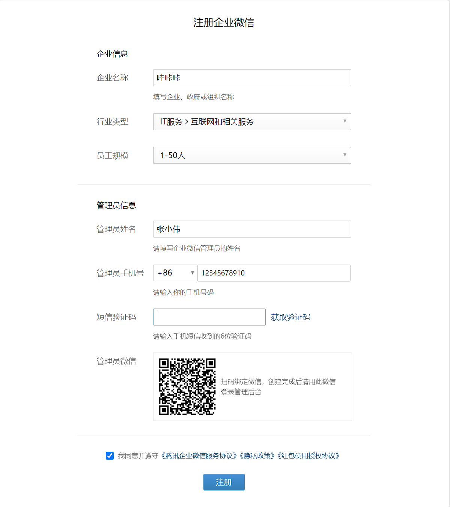
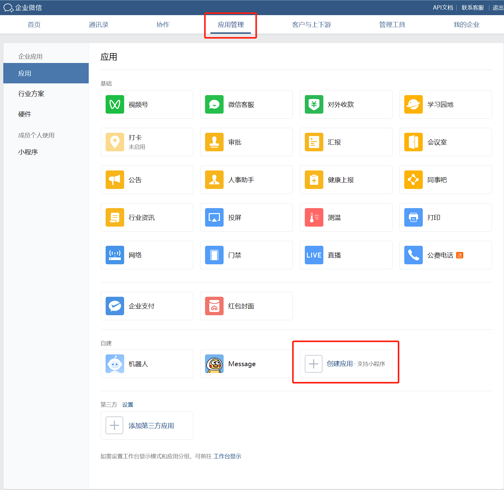
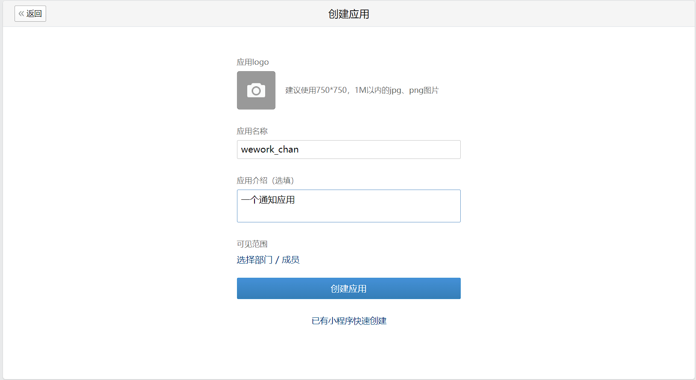
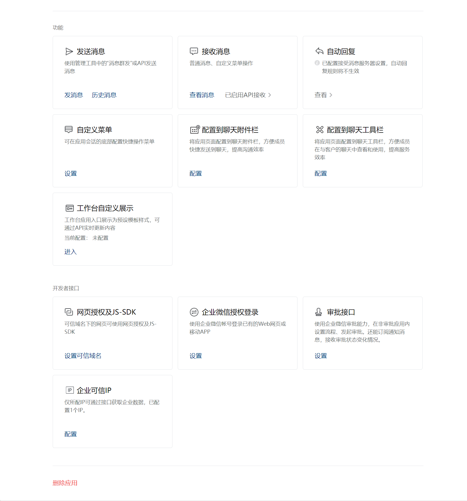
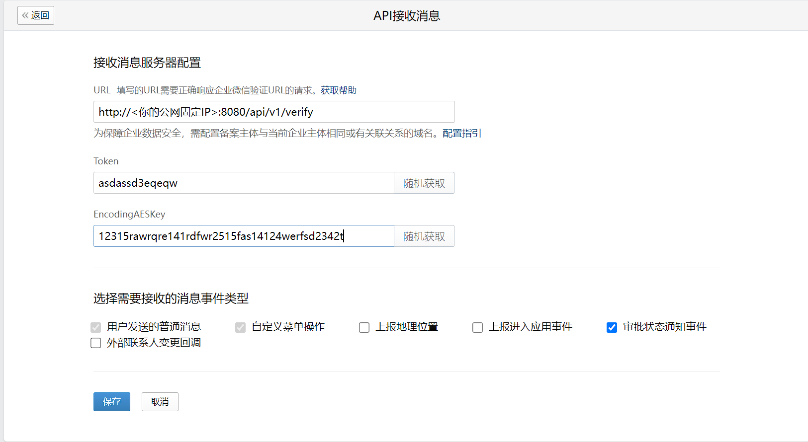
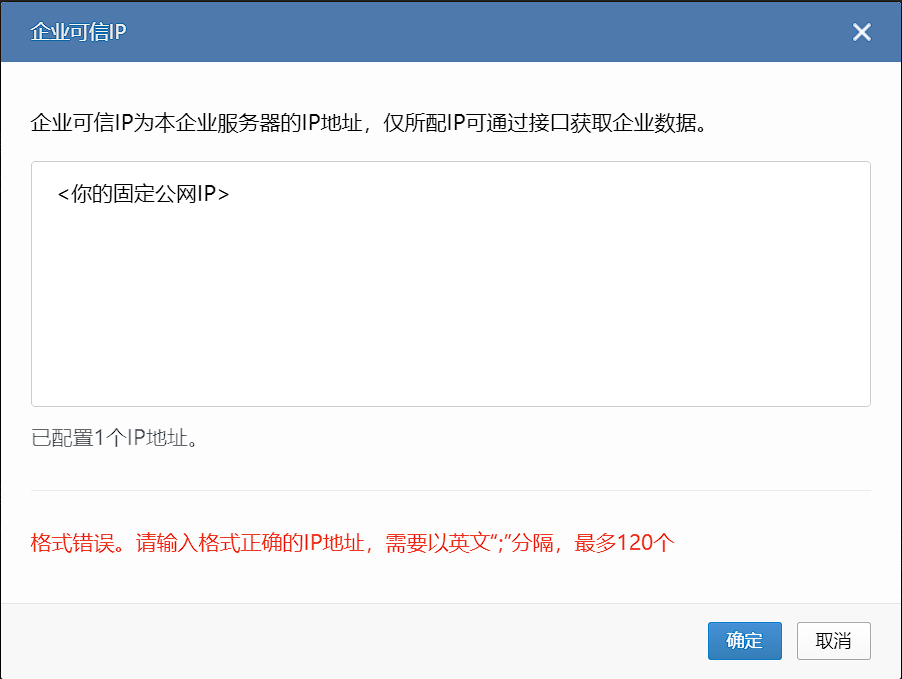

# wework_chan

## 功能
由于企业微信官方限制，2022年6月20日后创建的企业微信应用需要有固定的公网IP地址并加入IP白名单后才能接收到消息，本软件通过用具有公网IP的服务器进行反向代理来实现绕过IP验证。

## 使用

1. 拥有一个具有公网固定IP的服务器
2. 编译或下载最新的wework_chan包
3. 更改`wework_chan.ini`文件，使用`supervisord`托管进程（若习惯systemd托管也可以，按自己需求来）
    ```bash
    # 安装supervisord 若已安装可略过该步骤
    $ sudo yum install supervisor
    # 拷贝配置文件
    $ cp wework_chan.ini /etc/supervisord.d/wework_chan.ini
    # 创建日志文件目录
    $ mkdir -p /var/log/supervisord/
    # 启动wework_chan
    $ supervisorctl start wework_chan
    ```
4. 之后在[企业微信官网](https://work.weixin.qq.com/wework_admin/register_wx)注册一个企业。

5. 网页登录企业微信后台，选择应用管理，创建应用


6. 创建好应用后，拉到应用页面最下边，选择企业可信IP

7. 未配置企业可信域名或者接受消息服务器配置的，需要先配置接收消息服务器。

8. 验证之后，即可配置企业可信IP

9. 此时将请求的`qyapi.weixin.qq.com`转换为`http://<你的服务器IP:8080>`即可

